# Database Schema Diagram

## Table relationships (Mermaid ERD)

```mermaid
erDiagram
    USERS ||--o{ ORG_MEMBERS : "has members"
    ORGANIZATIONS ||--o{ ORG_MEMBERS : "has members"
    ORGANIZATIONS ||--o{ BUDGET : "scopes"
    ORGANIZATIONS ||--o{ PAYMENT_SOURCES : "scopes"
    ORGANIZATIONS ||--o{ TRANSACTIONS : "scopes"
    ORGANIZATIONS ||--o{ SAVINGS : "scopes"
    ORGANIZATIONS ||--o{ LENDING : "scopes"
    ORGANIZATIONS ||--o{ GOLD_ITEMS : "scopes"
    ORGANIZATIONS ||--o{ CASH_LOANS : "scopes"
    ORGANIZATIONS ||--o{ EMI_LOANS : "scopes"
    ORGANIZATIONS ||--o{ JEWEL_LOANS : "scopes"
    ORGANIZATIONS ||--o{ SUBSCRIPTIONS : "scopes"
    ORGANIZATIONS ||--o{ MUTUAL_FUNDS : "scopes"
    ORGANIZATIONS ||--o{ STOCKS : "scopes"
    ORGANIZATIONS ||--o{ VAULT_APPS : "scopes"
    ORGANIZATIONS ||--o{ BANKING_RECORDS : "scopes"
    ORGANIZATIONS ||--o{ INSURANCE : "scopes"
    ORGANIZATIONS ||--o{ PERSONS : "scopes"
    ORGANIZATIONS ||--o{ ATTENDANCE : "scopes"
    ORGANIZATIONS ||--o{ STAFF_MEMBERS : "scopes"
    ORGANIZATIONS ||--o{ INTEGRATION_PROVIDERS : "scopes"
    ORGANIZATIONS ||--o{ ORG_INTEGRATIONS : "scopes"
    
    PAYMENT_SOURCES ||--o{ TRANSACTIONS : "payment mode"
    TRANSACTIONS ||--o{ LENDING : "transaction ref"
    
    CASH_LOANS ||--o{ CASH_LOAN_REPAYMENTS : "tracks"
    EMI_LOANS ||--o{ EMI_LOAN_REPAYMENTS : "tracks"
    JEWEL_LOANS ||--o{ JEWEL_LOAN_REPAYMENTS : "tracks"
    
    GOLD_ITEMS ||--o{ GOLD_HISTORY : "history"
    
    VAULT_APPS ||--o{ BANKING_RECORDS : "category"
    PERSONS ||--o{ INSURANCE : "beneficiary"
    PERSONS ||--o{ BANKING_RECORDS : "person"
    
    STAFF_MEMBERS ||--o{ ATTENDANCE : "tracks"
    
    INTEGRATION_PROVIDERS ||--o{ ORG_INTEGRATIONS : "defines"
```

---

## Core tables (Platform)

### `users`
- **PK:** `email` (text)
- **Columns:** display_name, role (`admin` | `member`), status (`active` | `suspended`), token, settings (JSONB)
- **Usage:** Login, platform admin access, user profile
- **Owner:** shared

### `organizations`
- **PK:** `id` (text)
- **Columns:** name, slug (unique), status, enabled_apps (JSONB), enabled_menus (JSONB), enabled_integrations (JSONB), settings (JSONB)
- **Usage:** Multi-tenancy root; stores which apps/menus/integrations enabled per org
- **Owner:** shared

### `org_members`
- **PK:** `id` (text)
- **FK:** org_id → organizations, user_email → users
- **Columns:** role (`admin` | `member`)
- **Usage:** User-to-org mapping; controls per-org permissions
- **Owner:** shared

### `schema_migrations`
- **PK:** `version` (text)
- **Columns:** name, applied_at (timestamp)
- **Usage:** Migration history tracking
- **Owner:** shared

---

## Financial tables (fintracker)

### `budget`
- **Columns:** org_id, month_year, category, amount (numeric 12,2), start_month, end_month
- **Owner:** fintracker

### `payment_sources`
- **Columns:** org_id, name, source_type, used_for, is_active, sort_order
- **Owner:** fintracker

### `transactions`
- **Columns:** org_id, date, description, amount, category, type, mode (payment label), transfer_to, month_year
- **Owner:** fintracker

### `savings`
- **Columns:** org_id, date, account (`payment_sources.id`), to_account (`payment_sources.id` for transfers), amount, type (INCOME/EXPENSE/TRANSFER), category
- **Owner:** fintracker

### `lending`
- **Columns:** org_id, name, amount, rate, months, start_date, transaction_id (FK)
- **Owner:** fintracker

### Gold module (fintracker)
- **`gold_items`** — item (ring, necklace, etc.), weight, purity, purchase_price
- **`gold_history`** — price tracking per item
- **`gold_resources`** — reference data (purity rates, etc.)
- **Owner:** fintracker

### Loans module (fintracker)
- **`cash_loans`** + **`cash_loan_repayments`** — cash loan tracking + repayment log
- **`emi_loans`** + **`emi_loan_repayments`** — EMI loan tracking + repayment log
- **`jewel_loans`** + **`jewel_loan_repayments`** — jewelry-backed loan tracking + repayment log
- **Owner:** fintracker

### `subscriptions`
- **Columns:** org_id, name, amount, frequency, renewal_date, status, category
- **Owner:** fintracker

### Portfolio (fintracker)
- **`mutual_funds`** — org_id, scheme_code, folio_no, quantity, avg_price, last_price, last_price_date, pledged_quantity
- **`stocks`** — org_id, symbol, quantity, avg_price, last_price, last_price_date
- **`gold_items`** — (see gold module)
- **Owner:** fintracker

### Integrations
- **`integration_providers`** — org_id, slug (e.g., "upstox"), name, client_id_enc, client_secret_enc, redirect_uri, settings (JSONB)
- **`org_integrations`** — org_id, provider_id (FK), access_token_enc, refresh_token_enc, expires_at, status
- **Owner:** admin (managed in admin app); used by fintracker for Upstox sync
- **Encryption:** `_enc` columns use `FIELD_ENCRYPTION_KEY` (AES-256-GCM)

---

## Vault tables (vault)

### `vault_apps`
- **Columns:** org_id, app_name, username, password_enc, site_url, notes, tags (JSONB)
- **Owner:** vault

### `banking_records`
- **Columns:** org_id, bank_name, account_type, account_number_enc, ifsc_code, balance, vault_app_id (FK), person_id (FK)
- **Owner:** vault

### `insurance`
- **Columns:** org_id, policy_number, provider, amount, start_date, end_date, beneficiary_id (FK), notes
- **Owner:** vault

### `persons`
- **Columns:** org_id, name, email, phone, dob, relationship, notes
- **Usage:** Beneficiary/contact list
- **Owner:** vault

---

## Staff tables (staff)

### `staff_members`
- **Columns:** org_id, name, email, phone, designation, hire_date, status
- **Owner:** staff

### `attendance`
- **Columns:** org_id, staff_id (FK), date, status (`present` | `absent` | `half`), notes
- **Owner:** staff

---

## Encryption

Sensitive columns (secrets, PII) use `_enc` suffix + `FIELD_ENCRYPTION_KEY` (AES-256-GCM):

| Table | Column | Contents |
|---|---|---|
| `integration_providers` | `client_secret_enc` | OAuth secret |
| `org_integrations` | `access_token_enc` | OAuth access token |
| `org_integrations` | `refresh_token_enc` | OAuth refresh token |
| `vault_apps` | `password_enc` | App password |
| `banking_records` | `account_number_enc` | Bank account number |

Ciphertext format: `ftenc:<keyId>:<base64url(iv + authTag + ciphertext)>`

See `ai/docs/sensitive-field-encryption.md`.

---

## Naming conventions

| Type | Example | Type |
|---|---|---|
| Timestamp | `created_at`, `updated_at` | `timestamp DEFAULT now()` |
| Boolean | `is_active`, `is_recurring` | `boolean DEFAULT true` |
| Encrypted text | `password_enc`, `token_enc` | `text` (nullable) |
| Money | `amount`, `balance` | `numeric(12, 2)` or `numeric(12, 4)` |
| JSONB config | `settings`, `enabled_apps`, `tags` | `jsonb DEFAULT '{}'` |
| UUID/nanoid | `id` (PK), `org_id` (FK) | `text` |

---

## Related

- `ai/skills/db-workflow.md` — how to make schema changes
- `ai/docs/migrations.md` — detailed migration steps
